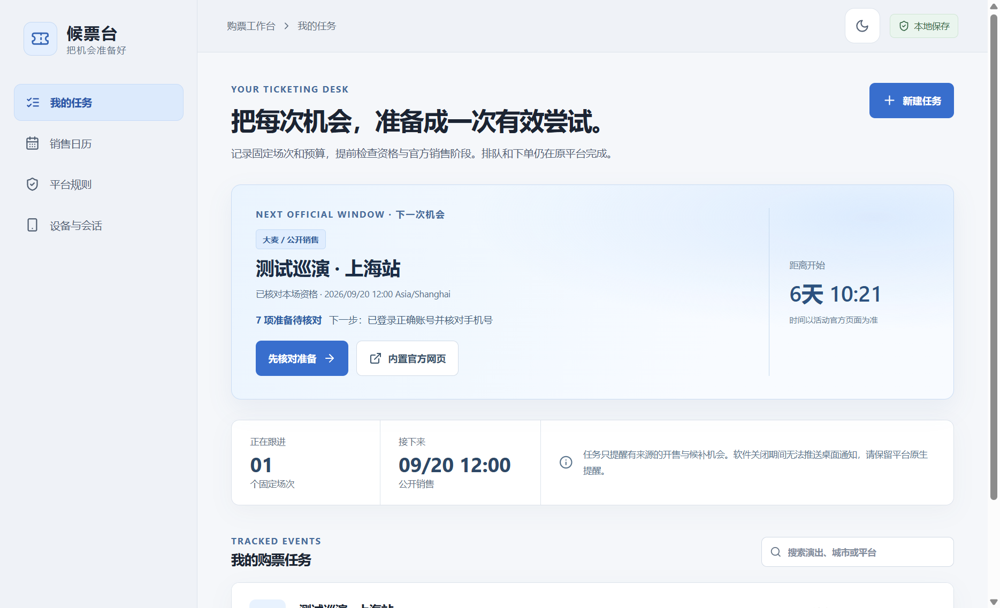
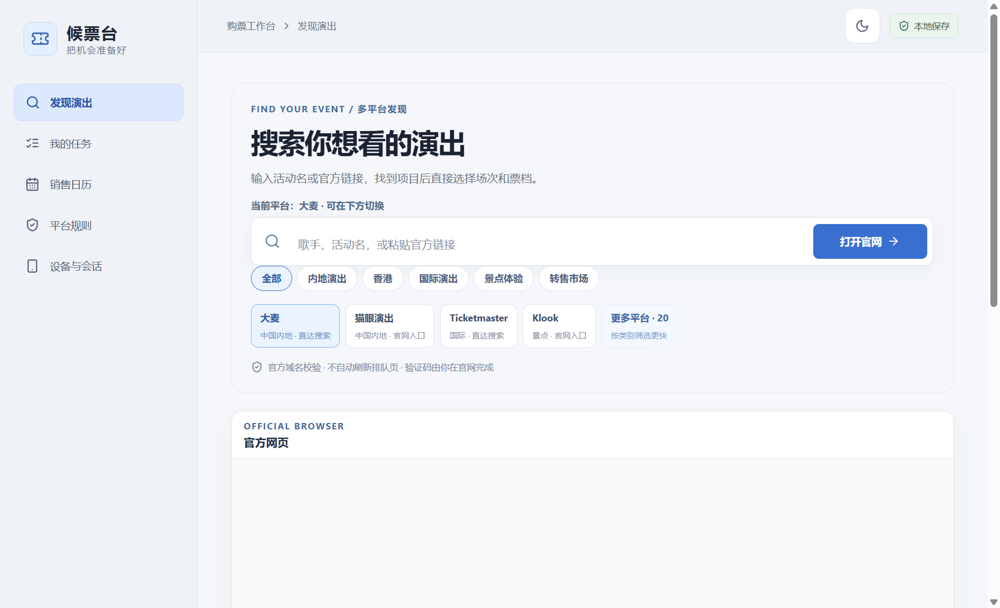
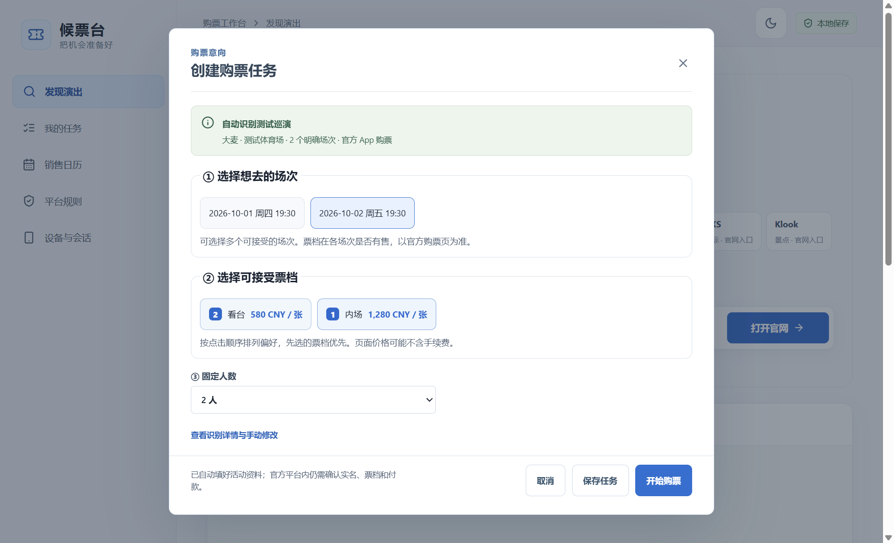

# 候票台

候票台是一款中文购票准备工具，提供 **Windows 桌面版**和**本地网页版本**。它把一场演出的已确认场次、人数、可接受票档、官方销售机会、准备清单和订单结果放在同一个工作台，帮助你少漏掉有资格参加的机会，并在选票和付款时保持清楚的判断。







上图票档是本地界面测试数据，不代表任何实际演出的报价。

> 候票台不保证抢到票，也不提供自动刷新、绕过排队或验证码、自动下单与支付。页面显示可选、进入确认页、待支付、已付款待出票和已出票是不同状态；以官方平台的订单及出票结果为准。

## 下载与启动

### Windows 桌面版

从本仓库的 [Releases](https://github.com/yzh423/ticket-thief/releases) 下载最新版 `TicketWindow-Setup-版本号.exe` 并安装。安装后从开始菜单启动“候票台”。桌面版提供本地 SQLite 数据库、应用运行期间的 Windows 提醒、内置官方网页工作区，以及可选的 Android USB 连接检查。

从源码运行需要 Node.js 24、pnpm 11 和 Windows PowerShell：

```powershell
git clone https://github.com/yzh423/ticket-thief.git
cd ticket-thief
pnpm install --frozen-lockfile
pnpm start
```

`pnpm start` 会先构建，再打开 Electron 窗口；`pnpm dev` 是同一启动流程。**桌面版不会启动一个供普通浏览器访问的 HTTP 网站。**

### 本地网页版本

如果希望在 Chrome、Edge 等普通浏览器中使用，请在项目目录运行：

```powershell
pnpm install --frozen-lockfile
pnpm web
```

Vite 会自动打开浏览器；如果没有自动打开，请访问终端打印的 `http://127.0.0.1:端口/` 地址。请保持这个终端窗口运行。`pnpm web` 只在本机启动网页服务，GitHub 仓库地址本身不是网页应用地址。网页版本的**搜索在当前标签页**进入经过域名检查的官网，使用浏览器“返回”回到候票台；已建任务的购票入口仍在新标签页打开。任务保存在**当前浏览器的本站本地存储**，与桌面版数据不互通。请在“网页版本说明”下载 JSON 备份；清除站点数据、换浏览器或换电脑会失去未备份的记录。导入会校验文件并覆盖当前浏览器的全部任务。网页版本没有内置浏览器会话、Windows 桌面提醒和 Android USB 功能。建议只在一个标签页编辑同一组任务。

## 如何使用

1. 打开“发现演出”，直接在顶部输入歌手、活动名或粘贴官方活动链接；默认使用大麦，平台选择和地区筛选在搜索框下方。当前提供 20 个官网入口；大麦和 Ticketmaster 支持关键词直达搜索，其他渠道打开官网后由你站内查找，留空也能直接打开官网。票星球、纷玩岛等尚无经核实的通用网页首页入口，可从具体活动官方链接进入任务，或使用原生 App。
2. 打开具体官方活动页后，桌面版会尝试自动读取公开活动信息；未出现识别结果时可点“读取活动信息”重试。大麦详情页可识别标题、场馆、明确列出的场次、单笔限购及公开价格范围；其他平台在页面含标准公开活动标记时，可带入明确的日期、票档名称和单价。候票台列出**当前来源明确给出的场次**，你点选想去的一个或多个场次；有逐档名称与单价时，再按偏好点选票档、选人数，点击“开始购票”保存任务并打开本场官方入口。平台、场馆、来源和核实日期自动带入；没有额外的预算输入，也不设置隐藏的金额上限。旧版任务仍可读取。只有价格范围而无逐档价格时，界面会明确提示，**不会**把范围上下限冒充票档；App 专属项目可尝试打开手机官方 App 查看票档，不能从网页推断 App 内所有可买票位。软件不会把日期范围猜成具体日期，也不自动推断不明确的所在地时区；无法确定时，仍需核对活动时区。
3. 从官方公告录入优先购、公开销售、正式补票、候补或邀请机会，写明资格、开始与截止时间、活动所在地时区和来源。添加机会时可展开“粘贴公告，辅助提取时间”：软件只列出含完整年份的日期与 24 小时时间，须由你选定正确的开售时间并核对原文后保存；粘贴内容不会写入任务。每次参与前用“核对来源 / 核对公告”打开原文，确认时间或资格是否变更。
4. 为任务及每条销售机会核对“购票渠道”：官方网页可购票、仅官方 App 购票，或暂未核实。大麦公开项目页若显示“该渠道不支持购买”，建任务时会预选 App 专属，仍请按该场当前公告确认。开售前在实际购票的官方网页或 App 中确认登录状态，并在原平台登记实名观演人。桌面版可通过已授权的 Android USB 连接打开大麦 App；其他 App 专属渠道目前提示手动打开。启动 App 不代表能直达具体场次，需要在 App 内定位。候票台不代填密码、证件号或支付资料。桌面版运行时会针对已录入机会发出阶段提醒；关闭后不会继续提醒。
5. 在官方页面人工判断票档与最终总价。状态不明时不要误认为售罄；已有有效订单时优先完成付款，不重复提交。
6. 分别记录排队、待支付、已付款待出票和已出票等结果，并保留官方确认依据。已有待支付订单时，可填写官方页面显示的支付截止；桌面版运行期间会在临近截止时提醒，首页也会突出显示待处理订单。始终以平台当前倒计时为准。

例如深圳站邓紫棋项目的[大麦公开页](https://detail.damai.cn/item.htm?id=1052123401368)在退票规则中明确列出 9 个 19:00 场次，但网页购票状态要求使用大麦 App，且只给出 ¥380–¥1680 的范围。候票台能显示**核实的 9 个场次**，但不能凭价格范围补造票档。此时点击“打开大麦 App 查看票档”，在原平台查看该场实际票档和完成购买；由于网页缺少逐档信息，不会创建一个伪装为已选好票档的任务。该项目页面还提示不支持自主选座，因此不能提供真实座位点选。

手机参与时，在“设备与会话”确认 Android 已授权，再从任务打开大麦原生 App；目前无法保证从网页直达具体活动。请在 App 内搜索活动，核对场次、票档、实名观演人与最终结算金额，按官方排队、下单和付款流程完成。桌面任务负责展示你选好的条件与销售机会提醒，手机上的账号登录、人员登记和支付始终留在原平台。iPhone 不支持 ADB，需手动打开相应官方 App。

首页“下一步”会根据已录入的销售机会、准备项和订单阶段，给每个任务标出一个当前动作并直达相应步骤。建议只使用你填写且已核实的信息；它不读取实时库存，也不是抢票概率评分。平台规则页提供与演出发现、原生票务和网页监控工具的对照，详细依据见[同类工具对照与升级方向](docs/同类工具对照与升级方向.md)。

内置网页仅供桌面版使用：发现与已建任务的官网均显示在主窗口的平台标签页，切换平台时保留各自的网页历史和独立登录会话。从任务打开时，页面上方固定显示人数和票档，并可一键返回任务。再次打开同一任务会复用该平台标签，不主动刷新排队会话。进入排队或结账后，请遵守平台规则，不要随意切换、关闭或刷新当前页面。标记为 App 专属的销售，网页入口只作为公告核对，不会把网页链接当作手机购票入口。普通 HTTPS 链接在 Android 上可能打开浏览器，并不保证跳进票务 App。HTTPS 登录跳转会尝试在当前标签继续；如平台限制内置浏览器或依赖独立弹窗，可从工具栏把当前页交给系统浏览器，或改用官方 App，并在官方页面核对订单。系统浏览器与内置网页的登录会话不共享。USB 连接诊断、Android 官方链接发送和 iPhone 支持边界见[交互与设备适配](docs/交互与设备适配.md)。

## 平台与数据边界

大麦、Ticketmaster 已接入关键词直达搜索；其他列出的平台接入官网首页，站内搜索由用户完成。大麦有专门的公开详情字段读取；其他站点尝试读取标准 Event 标记中的演出时间与明确命名、标价的报价。识别候选项不是实时库存或可购买状态，且 App 专属项目的网页可能只公布价格范围。平台入口不代表已接入账号资料或交易接口。每场演出的实名、限购、候补和补票规则均以当场官方公告为准。候票台不会推测“整点回流”，也没有实测数据支持固定的成功率提升百分比。

桌面版任务保存在 Electron 用户数据目录中的 `tickets.sqlite`，保存时会更新同目录的 `.bak` 备份；内置网页 Cookie 和缓存按平台留在本机。网页版本的任务保存在浏览器本地存储。不要把密码、完整证件号或支付凭据写入任务备注；朋友应在各自设备上使用自己的账号与数据。

## 验证与打包

```powershell
pnpm test             # 规则、时区、订单状态及数据层测试
pnpm run typecheck
pnpm run test:ui      # Electron 窗口与任务流程
pnpm run test:web     # 浏览器启动、保存、刷新和官方入口
pnpm run dist         # 生成 Windows 安装包
```

`pnpm run test:ui` 使用隔离的用户数据目录。真实平台的登录、排队、支付、手机唤起与出票仍须在获准的活动和设备上逐场验证。详细能力与限制见 [功能审计](docs/功能审计.md)，设计依据见 [方案文档](docs/skills/specs/2026-09-14-ticket-assistant-design.md)。

## 常见启动问题

- **运行 `pnpm start` 后在浏览器输入 `localhost` 打不开：**这是桌面启动命令；改用 `pnpm web`，访问终端打印的地址。
- **网页版本白屏：**确认已经在项目目录安装依赖并从 `pnpm web` 的地址访问，而不是直接双击 `index.html`；检查终端构建错误，必要时运行 `pnpm run typecheck`。
- **内置官方页面空白或提示加载失败：**先确认任务中的 HTTPS 官方网址是有效的具体项目入口；点击工作区的“系统浏览器”或改用官方 App。部分网站不允许在内置浏览器完成全部流程，切换窗口可能失去原排队会话。
- **安装包打不开：**先关闭旧版本候票台，再从开始菜单启动；若仍失败，使用 `pnpm start` 运行源码查看控制台错误，并保留本机 `tickets.sqlite` 与 `.bak` 备份。

本项目是购票流程辅助工具，与上述票务平台没有官方合作或授权关系。
